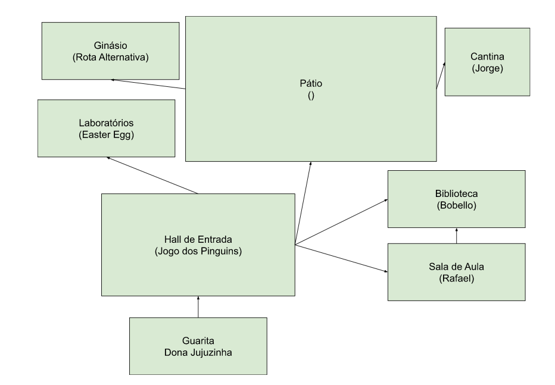

# Simulador de Greg

## Contexto

Eu e uns amigos estávamos recém começando a aprender a programar e tentamos
fazer um jogo em portugol.

### Os amigos

- [Eu (@Bemesko)](https://github.com/Bemesko)
- [@Rafael-Onesko](https://github.com/Rafael-Onesko)
- [@gregori-sabel](https://github.com/gregori-sabel)

Abaixo fica o mapa do jogo:



## Como Executar

```bash
docker run --rm -it bemesko/simulador-de-greg
```
